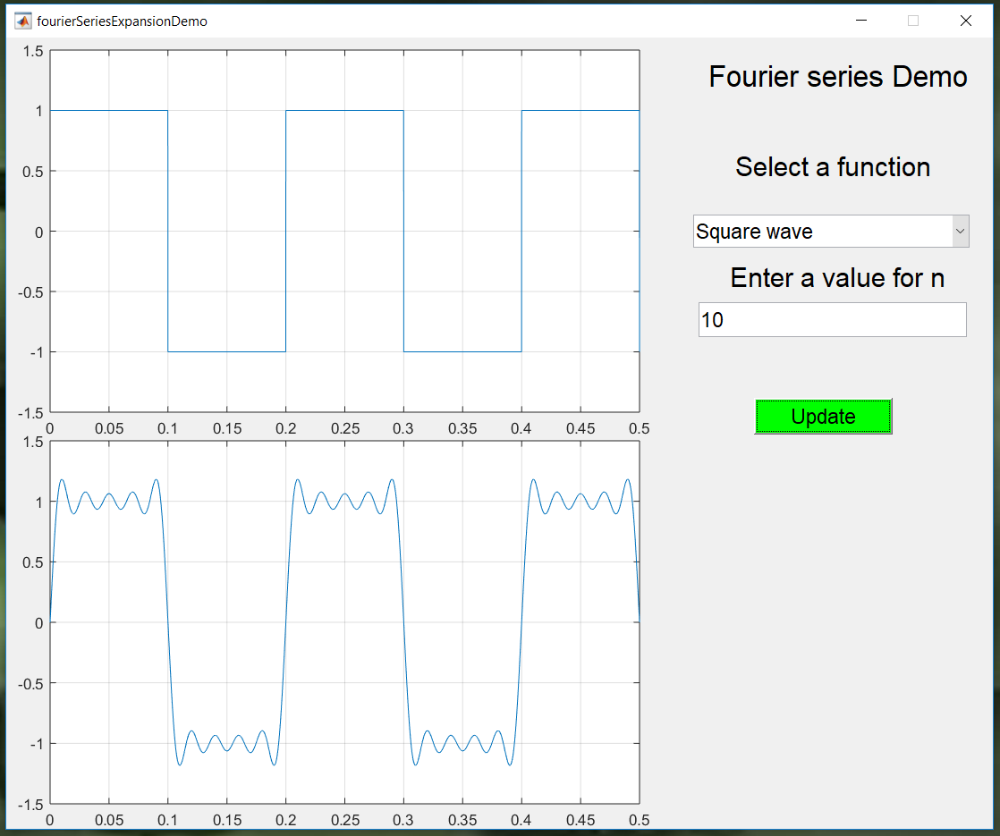

# Fourier-Series-Demo
A MATLAB GUI tool built using GUIDE, for demonstrating the trigonometric Fourier trigonometric series for the square and triangular waves for "arbitarily" :) large values of n.
   
## Demo

## Contributing
Contributions are always welcome!

## References
* Fourier series 
    - https://en.wikipedia.org/wiki/Fourier_series
    - https://www.electrical4u.com/trigonometric-fourier-series/
    - https://lpsa.swarthmore.edu/Fourier/Series/DerFS.html

* readme.md
    - https://github.com/karan/joe

### Todos

   - Increase number of functions
   - Numeric implementation
   - Add sound demo

License
----

MIT &copy; Kumbong Hermann

